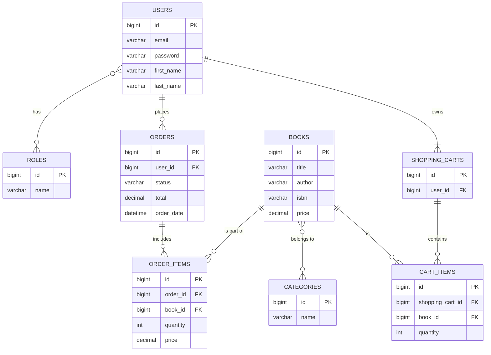

# Online Bookstore: A Spring Boot REST API

Welcome to the official repository for the Online Bookstore API. This project is a comprehensive, production-ready backend solution for a modern e-commerce platform, built entirely with the Spring Boot ecosystem. The primary motivation was to architect a system that is not only rich in features but also secure, scalable, and easy to maintain, addressing the core challenges of e-commerce backend development.

This API provides a complete foundation for managing users, a dynamic book catalog, shopping carts, and a full order-processing workflow, all exposed through a clean and well-documented RESTful interface.

### Table of Contents
1.  [Project Overview](#project-overview)
2.  [Key Features](#key-features)
3.  [Technology Stack](#technology-stack)
4.  [Architecture and Database Schema](#architecture-and-database-schema)
5.  [Getting Started](#getting-started)
6.  [API Functionality and Endpoints](#api-functionality-and-endpoints)
7.  [Challenges and Solutions](#challenges-and-solutions)
8.  [Using the API with Postman](#using-the-api-with-postman)
9.  [Testing](#testing)

## Project Overview

The goal of this project was to move beyond a simple CRUD application and build a backend that mirrors a real-world system. It solves the problem of creating a cohesive, secure, and state-of-the-art platform for selling books online. The architecture emphasizes a clear separation of concerns, from data persistence and business logic to the API controller layer, ensuring that the application is both robust and flexible.

## Key Features

*   **Secure Authentication & Authorization**: Stateless JWT-based authentication and role-based access control (USER, ADMIN) powered by Spring Security.
*   **Comprehensive Catalog Management**: Full administrative control over books and categories, including creation, updates, and deletion.
*   **Advanced Search Capabilities**: A flexible search API that allows users to filter books by various parameters like title, author, and more.
*   **Complete E-commerce Workflow**:
    *   **Shopping Cart**: Persistent carts for authenticated users with functionality to add, view, update, and remove items.
    *   **Order Processing**: A seamless checkout process to convert a shopping cart into an order, with history tracking for users.
*   **Automated Database Migrations**: Database schema is managed and versioned with Liquibase, ensuring consistency across all development and production environments.

## Technology Stack

This project is built on a foundation of powerful and widely-adopted technologies to ensure performance and reliability.

| Category              | Technology & Tools                                             |
| --------------------- | -------------------------------------------------------------- |
| **Backend Framework** | Spring Boot 3, Spring Framework 6                              |
| **Data Persistence**  | Spring Data JPA, Hibernate                                     |
| **Database**          | MySQL                                                          |
| **Security**          | Spring Security, JSON Web Tokens (JWT)                         |
| **API Documentation** | Swagger (OpenAPI 3)                                            |
| **Database Migration**| Liquibase                                                      |
| **Build & Dependencies**| Apache Maven                                                   |
| **Testing**           | JUnit 5, Mockito                                               |
| **Utilities**         | Lombok, MapStruct                                              |

## Architecture and Database Schema

The application follows a classic layered architecture (Controller -> Service -> Repository), which promotes clean separation of concerns. Data Transfer Objects (DTOs) are used extensively to decouple the API layer from the internal data models.

The database schema is designed to be normalized and efficient, establishing clear relationships between the core entities of the application.


## Getting Started

Follow these steps to set up and run the project on your local machine.

### Prerequisites

*   Java Development Kit (JDK) 17 or newer
*   Apache Maven 3.8+
*   MySQL 8.0+
*   A Git client

### Installation and Execution

1.  **Clone the Repository**
    ```bash
    git clone https://github.com/your-username/online-book-store.git
    cd online-book-store
    ```

2.  **Configure the Database**
    *   Open your MySQL client and create a new database:
        ```sql
        CREATE DATABASE bookstore;
        ```
    *   Navigate to `src/main/resources/application.properties` and update the database connection settings with your local credentials:
        ```properties
        spring.datasource.url=jdbc:mysql://localhost:3306/bookstore
        spring.datasource.username=your_mysql_username
        spring.datasource.password=your_mysql_password
        ```

3.  **Build and Run the Application**
    *   Use the provided Maven wrapper to start the application. This will also trigger Liquibase to automatically set up the database schema.
        ```bash
        ./mvnw spring-boot:run
        ```
    *   The API will be running and available at `http://localhost:8080`.

## API Functionality and Endpoints

The API is organized around REST principles, with different controllers responsible for specific domains.

*   **Authentication Controller (`/auth`)**: Handles user registration and login.
*   **Book Controller (`/books`)**: Provides public endpoints for viewing and searching books, and admin-protected endpoints for management.
*   **Category Controller (`/categories`)**: Similar to the Book Controller, provides public read access and protected administrative functions.
*   **Shopping Cart Controller (`/cart`)**: Manages the personal shopping cart for the currently authenticated user.
*   **Order Controller (`/orders`)**: Allows users to place orders and view their history. Includes admin functions for managing orders.

Once the application is running, a complete, interactive API documentation is available via Swagger UI at:
**[http://localhost:8080/swagger-ui.html](http://localhost:8080/swagger-ui.html)**

## Challenges and Solutions

Several interesting technical challenges were addressed during the development of this project.

1.  **Challenge: Secure and Stateless Authentication**
    *   **Problem**: How to secure an API without relying on server-side sessions, allowing it to be truly stateless and scalable.
    *   **Solution**: Implemented **JSON Web Tokens (JWT)**. After a user logs in, they receive a signed JWT. This token is then sent in the `Authorization` header of subsequent requests. A custom `JwtAuthenticationFilter` intercepts each request, validates the token, and sets up the Spring Security context, ensuring secure access to protected resources.

2.  **Challenge: Consistent Database Schema Across Environments**
    *   **Problem**: Manually managing SQL scripts for database setup and updates is error-prone and doesn't scale well.
    *   **Solution**: Integrated **Liquibase** into the project. All database schema changes (creating tables, adding columns, inserting data) are defined in versioned XML or YAML "changesets". On application startup, Liquibase automatically checks the database state and applies only the necessary changes, ensuring the schema is always correct and up-to-date.

3.  **Challenge: Avoiding Boilerplate Code and Ensuring Clean Architecture**
    *   **Problem**: Mapping between JPA entities and DTOs can lead to a massive amount of repetitive, manual code that is tedious to write and maintain.
    *   **Solution**: Leveraged **MapStruct**, a compile-time annotation processor that automatically generates type-safe and performant bean mappings. This significantly reduced boilerplate code in the service layer, improved readability, and enforced the separation between the data layer (entities) and the API layer (DTOs).

## Using the API with Postman

To make testing the API as easy as possible, a complete Postman collection is publicly available. You can view the collection in your browser and fork it directly into your own Postman client using the link below.

**[-> View the Public Postman Collection <-](https://www.postman.com/orbital-module-physicist-9886908/online-bookstore-project/collection/9v1y8eu/openapi-definition)**

### How to Use the Collection

1.  **Open the Link and Fork**: Click the link above. On the Postman webpage that opens, click the "Run in Postman" or "Fork" button to import the collection into your own client.
2.  **Start the Application**: Ensure the Spring Boot application is running locally (e.g., with `docker-compose up`).
3.  **Authenticate**:
    *   In the imported collection, find the `auth` folder and run the `POST Login a user...` request with valid credentials.
    *   Copy the `token` from the response body.
4.  **Test Protected Endpoints**:
    *   For any other request (like `GET Get all books...`), go to the `Authorization` tab.
    *   Set the **Type** to `Bearer Token`.
    *   Paste the copied token into the **Token** field and send the request.
## Testing

The project is equipped with a robust testing suite to ensure reliability and correctness of the business logic.

*   **Unit Tests**: Isolate and test individual components (services, mappers) using JUnit 5 and Mockito.
*   **Integration Tests**: Test the interaction between different layers of the application, from the API controllers down to the database, using `@SpringBootTest`.

To execute all tests, run the following Maven command from the project root:
```bash
./mvnw test
